# Why Intake Showcases Kujo

Intake is designed to demonstrate the kind of software the Kujo ecosystem is meant to make easier: local-first, agent-aware, auditable, source-agnostic workflows that can grow from deterministic rules into richer AI-assisted systems.

## Showcase Qualities

- Clear domain model: source, item, rule, policy, action, learning.
- Deterministic core loop that works without AI.
- Agent-ready records with raw payload references and normalized text.
- Human approval gates for risky behavior.
- Local operational controls: doctor, backup, restore, retention, purge.
- Extensible adapter surface for email, files, webhooks, Slack, and future systems.
- Evaluation suite that encodes product behavior, not just unit mechanics.

## Architecture

```mermaid
flowchart LR
  Source["Source adapters"] --> Raw["Raw payload store"]
  Raw --> Item["IntakeItem"]
  Item --> Rules["Rules and safety"]
  Rules --> Queue["Queue"]
  Queue --> Action["Draft or action"]
  Action --> Policy["Policy gate"]
  Policy --> Approval["Human approval"]
  Approval --> Execute["Execute or block"]
  Execute --> Audit["Audit logs"]
  Audit --> Learning["Strata and TotalRecall exports"]
```

## Future Kujo Language Integration

Potential next integrations:

- Express policy packs as Kujo scripts.
- Define adapter orchestration as Kujo workflows.
- Ship Intake as a Kujo package example.
- Provide side-by-side JavaScript and Kujo implementations for selected flows.
- Use Intake evals as a reference for Kujo agent workflow testing.

The current implementation is JavaScript/Node so it can be run and inspected easily today, while the architecture is intentionally shaped around Kujo-style workflow boundaries.
